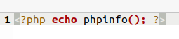
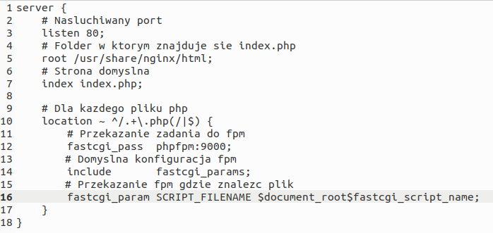
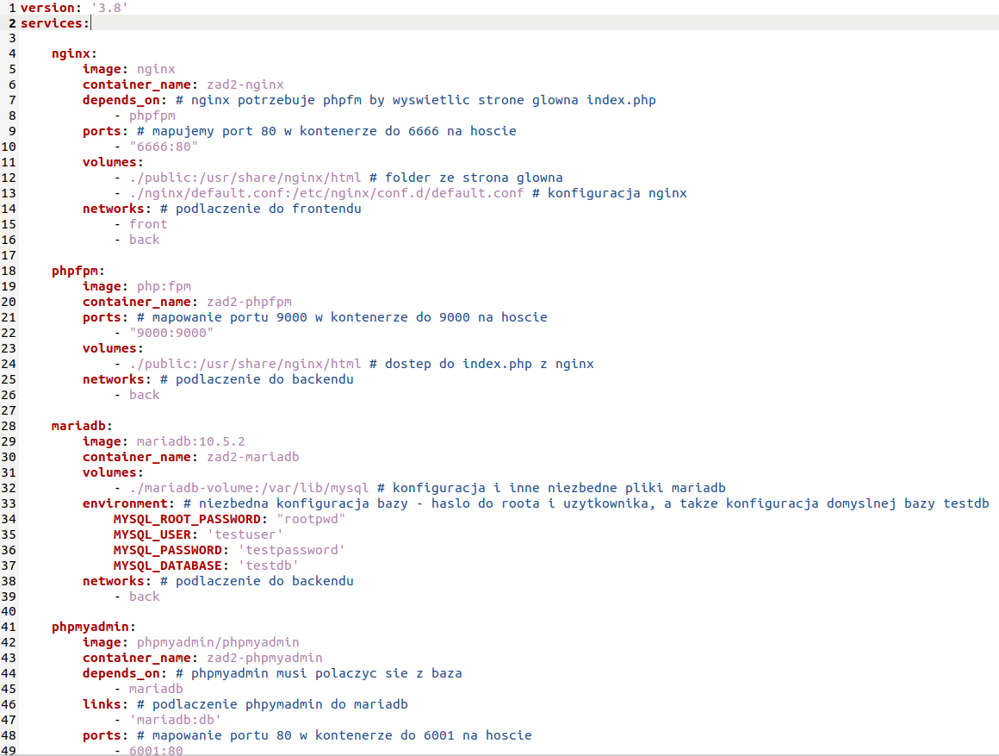
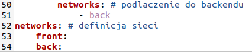
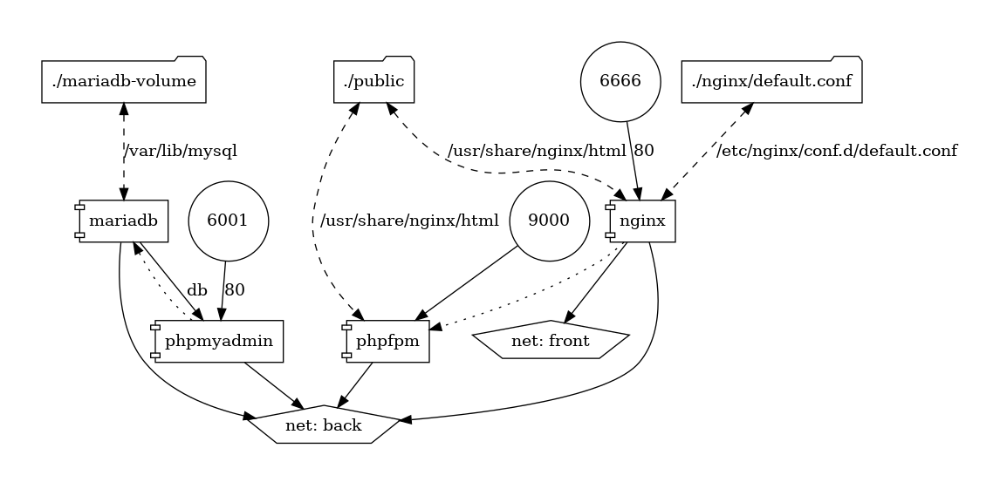

# Opis projektu
Plik Docker Compose generujący usługę LEMP wraz phpMyAdmin. Usługa składa się z 4 kontererów: Nginx, PHP-FPM, MySQL i phpMyAdmin.
# Treść plików
index.php, wyświetlający informacje o instalacji PHP  

    
default.conf, konfiguracja nginx   
      
docker-compose.yml  
  
    

# Reprezentacja graficzna projektu  
      

# Polecenie uruchamiające cały stack wraz z phpMyAdmin, utworzenie testowej bazy
sudo docker compose up -d  
baza zostaje stworzona dzięki konfiguracji "MYSQL_DATABASE: 'testdb'" w docker-compose.yml
